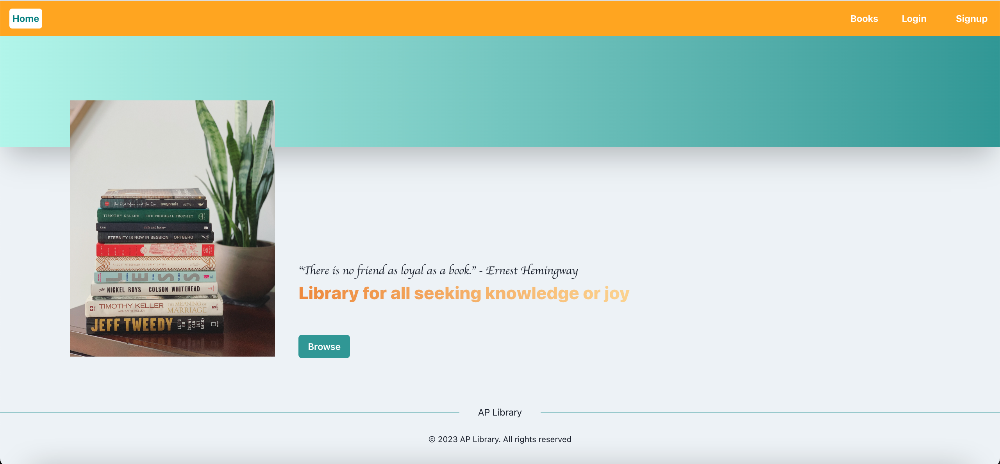

# About the app
This is a full-stack library web application built using React and Django frameworks. The data of books is taken from https://www.kaggle.com/datasets/thedevastator/comprehensive-overview-of-52478-goodreads-best-b . The application is deployed to digitalocean using digitalocean kubernetes service (DOKS) and the deployment is managed using Terraform. The application can be accessed at https://www.bookslibrary.app .

# Table of contents
- [About the app](#about-the-app)
- [Table of contents](#table-of-contents)
  - [About The Project](#about-the-project)
    - [Built With](#built-with)
    - [Application features](#application-features)
      - [General](#general)
      - [Authentication system](#authentication-system)
  - [Getting started](#getting-started)

## About The Project

### Built With

The main technologies used for building and running the application are listed below:

- [TypeScript](https://www.typescriptlang.org/) - A programming language
- [React](https://react.dev/) - A javascript framework used to build the UI of the application 
- [Chakra UI](https://chakra-ui.com/) - A css framework for building React applications
- [Django](https://www.djangoproject.com/) - A python framework for building web applications
- [Docker](https://img.shields.io/badge/docker-%230db7ed.svg?style=for-the-badge&logo=docker&logoColor=white)  - A software used to build, test, and deploy applications.
- [Nginx](https://www.nginx.com/) - A web server that can be used as a reverse proxy, load balancer, mail cache and HTTP cache.
- [Kubernetes](https://kubernetes.io/) - An open-source system for automating deployment, scaling, and management of containerized applications.
- [Terraform](https://www.terraform.io/) - An infrastructure as code tool that lets you define both cloud and on-prem resources in human-readable configuration files that you can version, reuse, and share.

### Application features
#### General
  - The users can search and filter books based on different criteria.
  - The users can view the details of a book.
  - The users can borrow books if they are logged in.

#### Authentication system
The application has its own login system which is managed in the server using Django session authentication. 

## Getting started
After cloning this repository, you can get the full-stack application running locally using any one of the following ways:
#### Using docker-compose
- Install docker (https://docs.docker.com/get-docker/)
- Add `.env` file to the root directory. Add variables included in `env.example` file to `.env` file. You may also generate your own secret key for Django app.
- `docker compose build` to build the application in the root folder
- `docker compose up -d` to start the application. The application can be accessed at http://localhost/.
- `docker compose down` to close the application
#### Using kubernetes
- Install docker (https://docs.docker.com/get-docker/)
- Install minikube. You can find the instructions here (https://minikube.sigs.k8s.io/docs/start/)
- Start minikube using the following command `minikube start` in the terminal
- Run the following command in your terminal `kubectl apply -f=kubernetes-deployment-local.yaml`
- Run the command in the terminal `minikube tunnel`
- The application can then be accessed at http://localhost/

